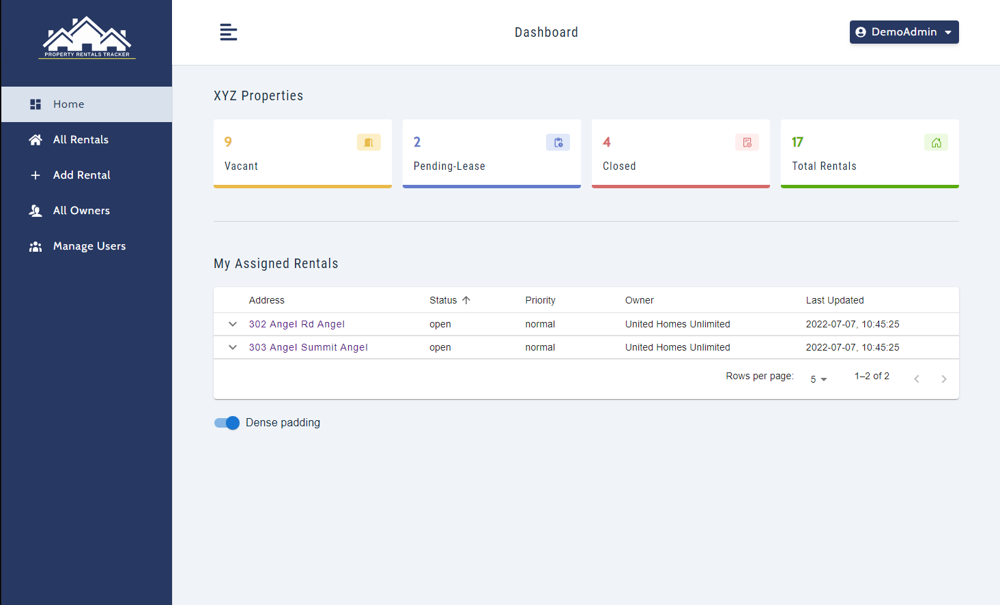
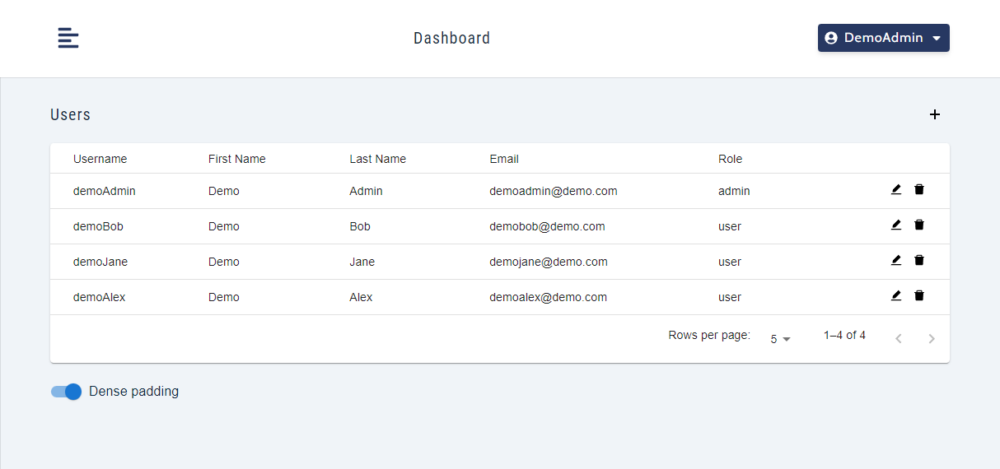
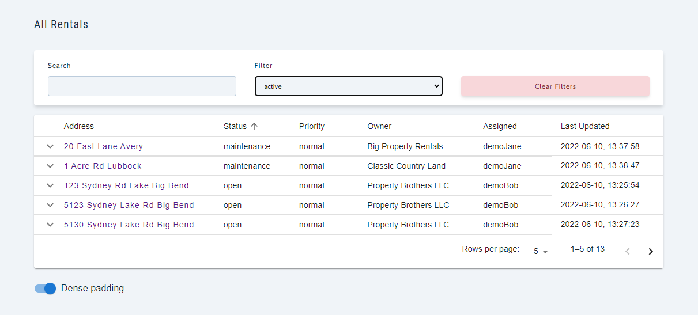

# Property Rentals Tracker

  

MERN Stack application that allows users to track rental properties and associated tasks

### Latest activity/update (07/11/2022)
  - code refactor and minor bug fixes

## Tech Stack

* Front-end:
  - ReactJS, react-router-dom, react-icons
  - useContext and useReducer React Hooks for state management
  - styled-components
  - Material UI (tables and tooltips)
  - axios
  - moment (date formatting)

* Back-end:
  - mongoose
  - bcrypt and jsonwebtoken for authentication
  - express
  - express-async-errors, http-status-codes, validator

## Some Features

  

    <i>Dashboard shows summary/stats of all rentals and the logged in user's assigned rentals.</i>
  

  

    
  

  

    <i>Users with the admin role have access to the manage users page.</i>
  

  

    
  

  

    <i>Search and filter through all rentals (active and inactive). The default setting is to exclude inactive rentals.</i>
  

  

    
  

## Tests
- No tests as of the moment

## Contributions
- If you'd like to collaborate or contribute to this app, please email - neemavelasco@gmail.com
